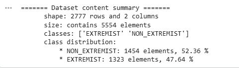
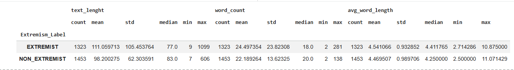
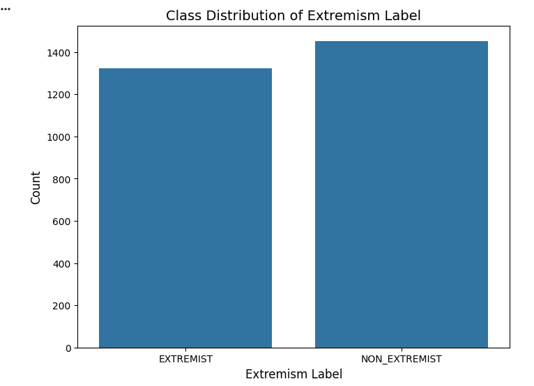

# 
Mobile Big Data Analytics & Management - Assignment 2

## A. Quantitative Analysis
* Dataset statistics
    * Dataset shape, size, class count, class distribution:

    * Droping the duplicates in a dataset helps prevent Data Leakage
    * The dataset contained 1 missing value and no duplicated ones. One missing value was dropped, because since it was a categorical value, it won't be relevant to fill it with any place holder, or filling it with one of the most frequent data too (because we were just asked to drop duplicated value if there were).
    * Text characteristics

    For the new added columns, the above image shows that the **EXTREMIST** class is more extreme in its length while the **NON-EXTREMIST** class is more dense.
    * Visualizations

This bar chart shows that the classes are well balanced.

* Linguistic Analysis
    * Overall, the top 20 most frequent words are: `'the', 'a', 'to', 'you', 'and', 'of', 'i', 'is', 'are', 'bitch', 'not', 'in', 'that', 'it', 'with', 'they', 'all', 'kill', 'for', 'do'`
    * Per class, here are the top 20 most frequent words:
        * EXTREMIST: `'the', 'to', 'and', 'of', 'you', 'a', 'are', 'i', 'is', 'kill', 'not', 'they', 'it', 'all', 'in', 'with', 'that', 'them', 'us', 'get'`
        * NON-EXTREMIST: `'a', 'the', 'you', 'to', 'bitch', 'i', 'of', 'and', 'is', 'not', 'that', 'are', 'in', 'with', 'it', 'for', 'my', 'do', 'fucking', 'trump'`
    * After visual comparison, here are the 5 most prominent words per classes:
        * EXTREMIST: `U, Let, Kill, attack, people`
        * NON-EXTREMIST: `Bitch, Fucking, Trump, face, fuck`
## B. Qualitative Analysis
* Dataset annotation and validation: the annotated file can be found [here](dataset-related_files/mbd_annotation_sample_30.csv)
* Inter-Rater Reliability Analysis:
    The IRR Analysis shows that annotators 1, 3, 4, 5 show moderate so strong agreement, while annotator 2 appears to be an outlier among them with an agreement score of 0.0 with the others.
* Disagreement Analysis:
The results show a 100% inter-human disagreement rate, meaning that for every example at least one annotator disagreed with the others. This indicates that identifying extremist content in this dataset is highly subjective and often ambiguous. Several texts had three unique labels, suggesting strong differences in interpretation, especially in politically sensitive or indirectly harmful statements. Although disagreement was common, the majority vote still aligned with the original dataset labels in most cases, showing overall consistency with the dataset’s standards. However, in a few cases (IDs 15 and 23), the group labeled the content as EXTREMIST while the original label was NON_EXTREMIST, suggesting differences in how hate speech and extremism are defined. Overall, the findings highlight both the complexity of the task and the importance of clear annotation guidelines to improve labeling consistency.

## C. ML Baseline Model
The Baseline Logistic Regression Model trained shows the following initial report:

**Strong True Positive** and **Strong True Negative** are to be noted here, meaning that the model is performing well catching up most of the true labels.

On another side, the **almost symmetrical** statitics for both *false positive* and *false negative*  shows that the class balancing is working effectively.

## D. Required Error Analysis
### 1. Systematic Error Review
The error validation can be found at [text](dataset-related_files/errors_validation_10.csv)

### 2. Insights & Improvements
#### Miss classified labels
1. leaving a pot on the stove can burn more than just your dinner always stay in the kitchen while cooking more tips here (NON-EXTREMIST  classified as EXTREMIST) -> I think it is due to the context i.e., always stay in the kitchen while cooking and they have mentioned leaving pot on stove can burn more than dinner i.e., can it burn you if you stay in the kitchen? since it is inducing harm i think that is why it was missclassified.
2. hey these hashtags came up under your name for some reason murderer killer guilty guilty double murder brentwood naked gun -> Non extremist classified as extremist, this can be due to trigger words and extremism content although it is a text that is more of infoming as opposed to inducing harm.
3. if i ever saw kendall jones in person i d kill her on sight i hate that bitch more than anything in life -> Labled as Non extremist but model predicted extremist. I think it is due to the strong violent language i.e., kill her on site which is more personal and not targeting a group thus not fitting to extremist but the model might have prioritized the violent words in clasifying.
4. someone on facebook made a status defending him so i dropped a bomb full of knowledge on that bitch and unfriended -> Predicted as extremist, i think its due to the use of drop a bomb which the model might think as being targeted attack/violence.
5. got to love an eon a morning panic attack chest pains anxiety dickhead bpd. -> model might be sensitive to threat indicators i.e., panic attack is taken as harm thus the flagging.
6. ack of ethic... bringbackhangingfortreason trumpisatraitor.-> Predicted as Non extremist, this is a political target.
7. every supporter of the current white house occupant who continues to support him after his latest treasonous comments can all fuck right the fuck off... trumpisatraitor. -> Targeting and triggering a group of supproters and suggesting for their exlusion. predicted as Non Extremist as it does not contain the heavy extrimism words.
8. retweet if you verbally abuse a fuck boy is it considered animal cruelty asking for a friend. Labeled as Non extremism, this can be due to the last part, asking for a friend although the statement is dehumanizing it can slip as a form of sarcasm.
9. my baby mama tripped and that bitch can shoot -> Predicted as Extremist, this is likely due to "can shoot" as it can be a slang word tied to skill but the model sees this as a violent action.
10. let this hoe touch this kid i swear to fucking god i will murder you bitch facts-> Model predicts as Non Extremist despite being a murder threat and it is a direct threat compared to the kendal one where its more of like a fame based hate without clear plan as opposed to this one where it is "i will murder you".

#### Pattern
- Extremist is mostly due to overtriggered words, mixup e.g., the cooking example and the one for murder hashtags which is informative but since it contains heavy extremist words it gets wrongly classified.
- Non Extremist: Individual threats not considered as extremist and only looking at mostly the group tied extremism. E.g., let this hoe touch this kid i swear I will fucking kill you. Also when the content sarcarsm or jokes it might be wrongly classifed as Non Extremis.

#### Proposed improvement
* Using TF-IDF with bigrams (1–2 grams) and class balancing: allows the model to capture context that single words miss, while class balancing ensures the model doesn't ignore the minority "Extremist" class.
* Hyperparameter tunning (C Parameter): allows to find the "sweet spot" between a model that is too simple and one that is too complex. By calibrating this regularization strength, we ensure the Logistic Regression focuses on the most statistically significant patterns rather than getting distracted by "noise".
* Balanced Model on Validation Set: it provides an honest, realistic measure of how the model will perform on completely new, unseen data; prevents "data leakage" and ensure that the accuracy that we get, is a true reflection of the model's predictive power.